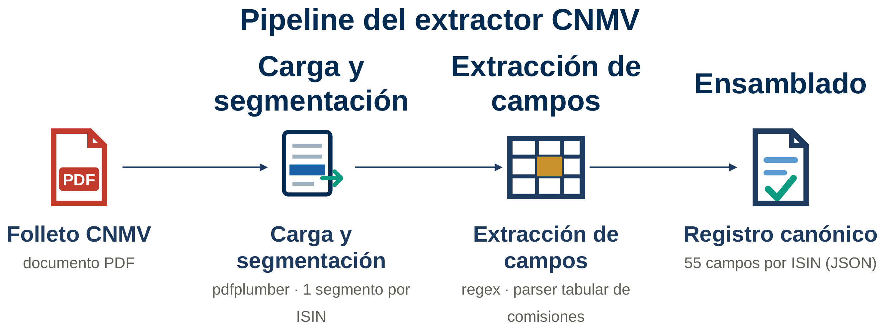
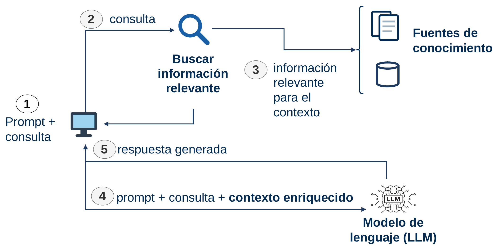
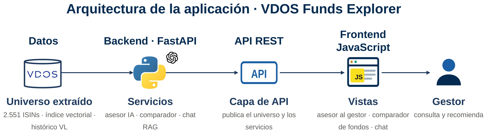

<h1 align="center">VDOS · Extracción y explotación de datos de fondos de inversión con IA</h1>

<p align="center">
  <em>Del folleto de la CNMV a un dato canónico explotable: extracción con reglas + LLM,
  RAG con citas verificables y asesoría por perfil de riesgo.</em>
</p>

<p align="center">
  
  
  
  
  
  
</p>

---

Versión pública y **saneada** del software de mi Trabajo de Fin de Grado
*«Arquitectura VDOS Stochastics: automatización de la descarga de documentación
legal y explotación de datos de productos financieros mediante IA generativa
basada en RAG»* (Grado en Física, Universidad Alfonso X el Sabio, 2026).

Convierte folletos de fondos de la CNMV en un **registro canónico de 55 campos**
por ISIN, y sobre ese universo monta herramientas de explotación: chat con citas,
un asesor por perfil de riesgo y comparador de fondos.

> ### Aviso de versión saneada (educativa)
> Este repositorio es una versión de **portfolio**. **No** contiene datos reales
> de fondos, ni la taxonomía interna de VDOS, ni credenciales. En concreto:
> - los **catálogos de códigos internos** (P00/P01/P05/P06) se sustituyen por
>   códigos *neutros de ejemplo* (`RF_EURO`, `RV_INTL_USA`, …);
> - los **datos reales** (folletos, ISIN, series de valor liquidativo) se
>   sustituyen por **3 fondos ficticios** en [`data_muestra/`](data_muestra/);
> - las **claves de API** y rutas internas se omiten (ver [`.env.example`](.env.example)).
>
> No uses este código para tomar decisiones de inversión.

## Qué hace

- **Extractor de folletos** — combina reglas deterministas (campos posicionales
  y un parser tabular de comisiones) con un LLM para los campos semánticos.
  Salida: 55 campos por ISIN, en orden fijo.
- **Clasificación P05/P06/P00** — el LLM elige una etiqueta de una lista cerrada
  (*constrained generation*, temperatura 0, salida estructurada); la traducción
  etiqueta a código ocurre en local.
- **RAG con citas** — almacén vectorial propio; cada respuesta cita el fondo por
  su ISIN, sin inventar fondos ni cifras.
- **Asesor por perfil MiFID** — un filtro determinista de idoneidad reduce el
  universo a los fondos admisibles por bandas de volatilidad; el LLM solo ordena
  y justifica dentro de ese espacio.
- **Comparador y noticias** — métricas cuantitativas desde el histórico de VL y
  titulares clasificados por sentimiento.

## Pipeline de extracción

<p align="center"></p>

## Cómo funciona el RAG

<p align="center"></p>

## Estructura

```
vdos-fondos-tfg/
├── extractor_cnmv/            # Núcleo de extracción + IA
│   ├── extractor/             #   parser de folletos CNMV
│   │   ├── schema.py          #     esquema canónico de 55 campos
│   │   ├── regex_fields.py    #     campos posicionales (reglas)
│   │   ├── table_fees.py      #     parser tabular de comisiones
│   │   ├── semantic_fields.py #     campos semánticos
│   │   ├── catalogs.py        #     lookup etiqueta <-> código (saneado)
│   │   └── llm/               #     clasificación P05/P06/P00 con LLM
│   ├── rag/                   #   índice vectorial, chat, asesor, noticias
│   └── tests/
├── web/
│   ├── backend/               # API FastAPI (capa fina sobre el núcleo)
│   └── frontend/              # HTML + Tailwind + JS vanilla
└── data_muestra/              # datos FICTICIOS para poder ejecutar
```

## Demo rápida (un comando)

Para verla funcionando en local con los datos de muestra:

- **Windows**: clic derecho en `demo.ps1` → *Ejecutar con PowerShell* (o `./demo.ps1`).
- **macOS / Linux**: `./demo.sh`

El script crea el entorno, instala dependencias, genera la base de datos de
muestra y arranca la app en <http://localhost:8000>. Las vistas Inicio y
Comparador funcionan sin clave; el Asesor y el chat requieren una `OPENAI_API_KEY`
real en el archivo `.env`.

## Puesta en marcha

Requisitos: Python 3.10+ y, para las funciones de IA, una clave de OpenAI.

```bash
python -m venv .venv && source .venv/bin/activate   # Windows: .venv\Scripts\activate
pip install -r requirements.txt
cp .env.example .env        # edita OPENAI_API_KEY
```

**Núcleo (extractor + RAG)**
```bash
cd extractor_cnmv
python -m extractor.cli --help          # opciones del extractor
streamlit run rag/streamlit_app.py      # UI de exploración (chat/asesor)
```

**Aplicación web**
```bash
cd web/backend
python scripts/build_db.py              # genera la BD del comparador (muestra)
uvicorn app.main:app --reload           # http://localhost:8000
```

## Cómo funciona la app web

<p align="center"></p>

La aplicación se sirve desde el backend FastAPI sobre el universo de fondos y
tiene cuatro vistas:

- **Inicio** — panel con los KPIs del catálogo (número de ISIN, gestoras y
  categorías) y dos distribuciones (por categoría y por gestora), además del
  estado del índice del RAG.
- **Comparador** — eliges dos fondos y la app calcula métricas cuantitativas a
  partir del histórico de valor liquidativo (rentabilidades, volatilidad,
  Sharpe, comisiones) y genera un resumen en lenguaje natural de las
  diferencias.
- **Asesor IA al gestor** — introduces el perfil del cliente (banda de
  volatilidad MiFID); un filtro determinista reduce el universo a los fondos
  admisibles y el LLM ordena y justifica la recomendación citando las cifras de
  cada ficha, sin inventar fondos ni datos.
- **Estudio comparativo** — la evaluación del TFG: compara las recomendaciones
  del asesor propio frente a un asistente generalista sobre varios perfiles de
  inversor.

Endpoints principales de la API (`/api/...`):

| Endpoint | Descripción |
|---|---|
| `GET /api/health` | Comprobación de estado |
| `GET /api/stats` | KPIs del catálogo |
| `GET /api/distribucion/categoria` | Distribución por categoría |
| `GET /api/distribucion/gestora` | Top-N gestoras por número de fondos |
| `GET /api/index/status` | Estado del índice de embeddings (RAG) |
| `GET /api/funds/...` | Datos y series del comparador |
| `POST /api/advisor/...` | Recomendación del asesor por perfil |

> Con los datos de muestra de [`data_muestra/`](data_muestra/) puedes levantar
> la app en local y navegar las vistas con fondos ficticios.

## Stack

`Python` · `pdfplumber` · `OpenAI gpt-4o-mini` · `FastAPI` · `Uvicorn` ·
`Streamlit` · `Tailwind CSS` · `JavaScript`

## Licencia

[MIT](LICENSE) © 2026 Elena Velázquez Verduras — Trabajo de Fin de Grado, UAX.
